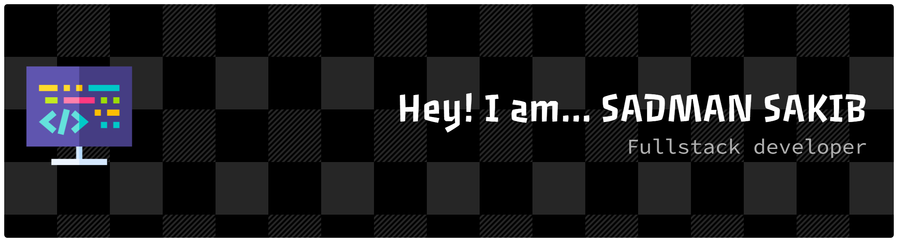

<!--- banner --->

 

<!--- title --->

  <ul align="center">
    
<h1 style="display: inline-block">Hi 👋, I'm Sadman Sakib</h1>

    <!--- typo --->
    
  </ul>

 

<!--- about --->
- 👋 Hi, I’m **[@Sadman-Sakib-AIUB](https://github.com/Sadman-Sakib-AIUB)**
- 🖥️ I’m currently working on **React.js, Next.js, Typescript** for frontend development.
- 🗄️ Using **Node.js, Express.js, MongoDB,PostgreSQL** for the backend.
- 🛠️ Current ongoing project **Zap Shift - Parcel Delivey Website**.
- 📫 Feel free to reach me out **[Email](sadmansakib.aiub@gmail.com)**
  
 

<!--- socials --->
## <b> FOLLOW ME ON SOCIALS:</b>

  

    
  

 

<!--- technology --->
##  <b> TECHNOLOGY STACK:</b>

### Languages:

### CSS Frameworks & Libraries:

### JavaScript Frameworks & Libraries:

### Database & Model:

### Deployment Platform:

### Design & Graphics:

### Tools & Technologies:

 

<!--- statistics --->
## <b> GITHUB STATISTICS & ANALYSIS:</b>

### GitHub Statistics:
|  |  |
| ------------- | ------------- |

### Repository Stats & Streak:
|  |
| ------------- |

 

---

<!--- visit count --->

  

